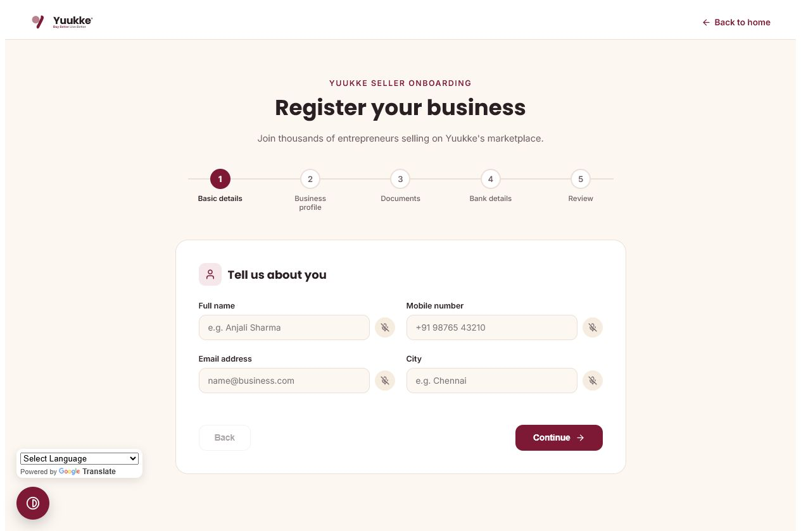
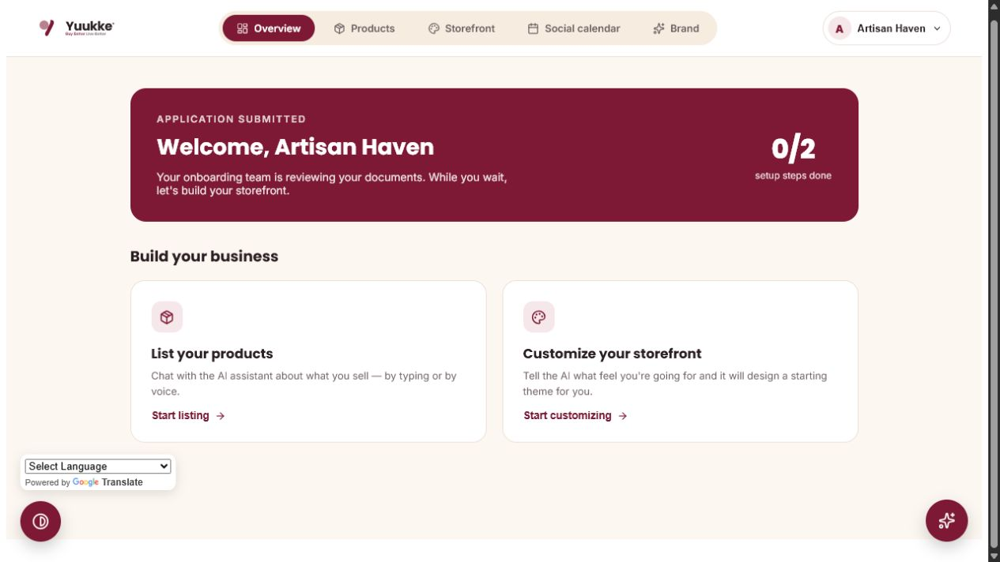
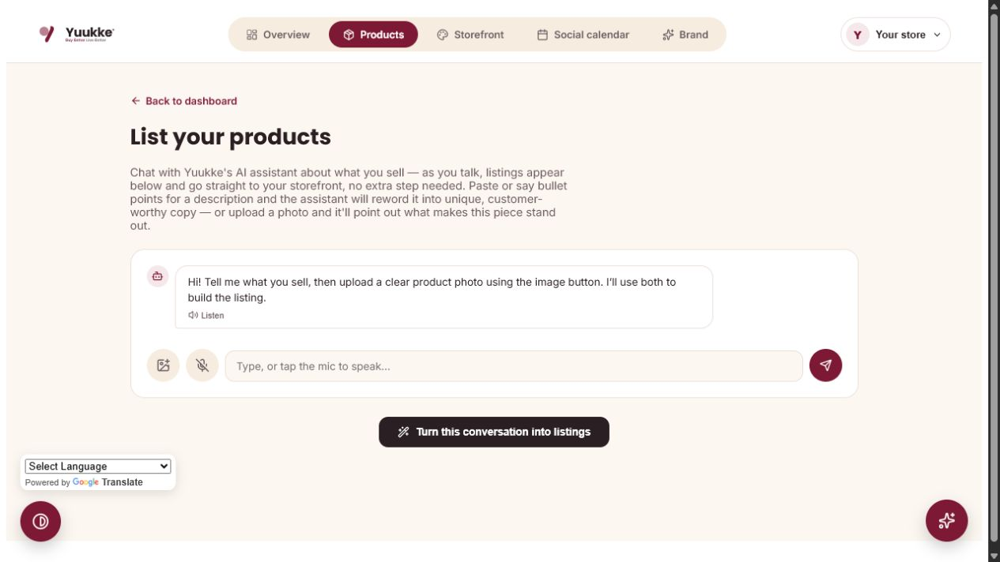
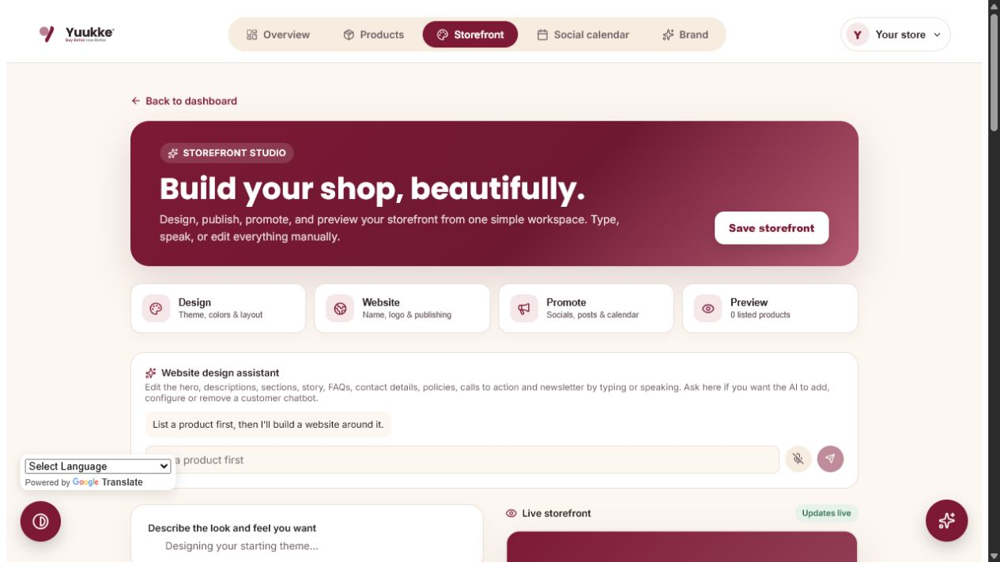
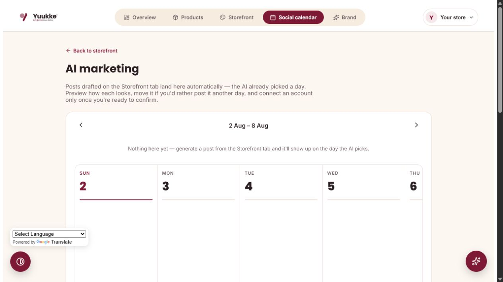
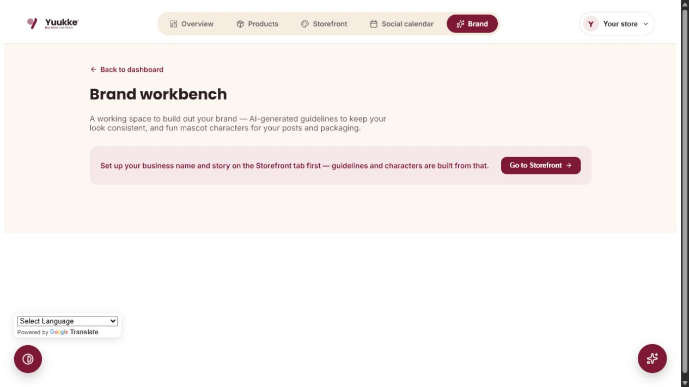
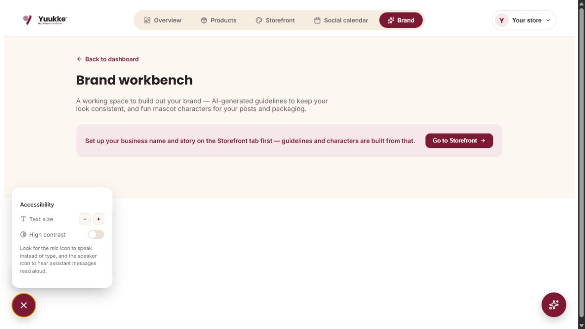

# Yuukke

A marketplace web app for women entrepreneurs — storefronts, AI-assisted product listings, 3D product previews, and a full marketplace with cart/checkout/orders.

## Business platform walkthrough

The business workspace takes an entrepreneur from registration to product creation, website publishing, marketing and performance learning. These screenshots were captured from the running prototype.

### 1. Seller onboarding



The five-step onboarding flow collects basic details, the business profile, optional documents, payout information and final review. Voice buttons are available beside supported fields, and drafts are preserved for the signed-in seller.

### 2. Business dashboard



The dashboard shows setup progress and provides direct access to product listings, the storefront studio, social calendar and brand workbench. The profile menu contains account information and logout.

### 3. AI product-listing assistant



The seller can type or speak product details and upload the actual product photograph inside the conversation. Yuukke turns the conversation into structured listings, assists with customer-ready descriptions and stores the resulting products under that seller.

### 4. Storefront studio and website assistant



The storefront studio combines a live preview with editable colours, hero styles, sections, business identity, calls to action, featured-product headings, mission, story, newsletter content, contact details and shop policies. The separate website-design assistant accepts typed or spoken changes and updates the preview using only the seller's saved products.

A customer-facing chatbot is intentionally not a manual checkbox on this page. The seller asks the website-design assistant to add, configure, disable or remove it; new storefronts start without one.

### 5. Social content calendar and analytics



Approved drafts receive clear calendar labels and can use either a seller-selected date or an AI-selected slot. The scheduling assistant understands requests to move a named post to another date or time. Calendar records, Postiz delivery status, Instagram performance and storefront views are stored for later marketing recommendations.

### 6. Brand workbench



The brand workbench builds reusable guidelines from the storefront identity: colours, voice, content pillars, caption guidance and product-specific poster assets. Saved brand information becomes context for later AI marketing work.

### 7. Accessibility controls



Accessibility tools remain available throughout the business workspace. They include adjustable text sizing, high-contrast mode, voice input, read-aloud controls and the Google Translate language widget.

## Business workflow

1. Create a secure account and complete seller onboarding.
2. Describe products by typing or speaking and upload their real images.
3. Review the generated listings and save them to the catalogue.
4. Generate a storefront from those listings and refine it through the website assistant.
5. Publish the storefront, create editable social drafts and schedule approved content through Postiz.
6. Use social and website analytics to improve future marketing suggestions.

## Technology stack

### Frontend

- **React 19** for the marketplace, seller dashboard, listing chat, live storefront builder, calendar, checkout, and account UI.
- **React Router 7** for marketplace, product, cart, order, and published-storefront URLs.
- **Vite 8** for development, API proxying, and production bundling.
- **Three.js, React Three Fiber, Drei, and Gaussian Splats 3D** for rotatable product models and the try-in-your-space scene.
- **Lucide React** for the accessible icon system.
- **Web Speech APIs** for voice input and read-aloud responses, with typed input as the fallback.
- **Google Translate widget** for interface translation.

### Backend and data layer

- **Node.js HTTP server** with handlers for authentication, products, storefronts, cart, wishlist, orders, AI, social scheduling, and 3D generation.
- **SQLite (`node:sqlite`)** with WAL mode and foreign keys for accounts, sessions, seller products, storefronts, carts, wishlists, orders, and social campaigns.
- **Repository/store modules** isolate SQL and ownership rules for authentication, products, sites, posts, carts, wishlists, and orders.
- **Authenticated seller boundaries** scope business data to the signed-in user and safely claim legacy browser data after login.
- **Public storefront aggregation** resolves a published slug and returns only that seller's listings—not the global marketplace catalogue.
- **Server-side validation and ownership checks** prevent sellers from changing another seller's data.
- **Scrypt password hashing**, random salts, cryptographically random bearer sessions, and server-only API credentials.
- **Media processing and proxy services** support images and generated assets during local development without exposing secret keys.

### AI and automation

- **OpenAI Chat Completions** for listing conversations, structured extraction, originality rewrites, document/photo understanding, storefront generation, live website edits, brand guidelines, and social captions.
- **OpenAI image generation** for logos, brand characters, and platform-specific social graphics.
- **Tripo3D API** for product-photo-to-3D generation and customer-space reconstruction.
- **Google Gemini Veo** for optional image-to-video social reels.
- **Postiz Public API** for connected Instagram/LinkedIn channels, media upload, and background scheduled publishing.

## Main data flow

1. A signed-in seller describes a product and uploads its photo in the listing conversation.
2. AI extracts the listing fields; the server saves the product and image under that seller.
3. The storefront generator receives only those saved listings and derives the content, sections, and color scheme from them.
4. The dedicated website chatbot accepts typed or spoken changes and updates the live preview after every successful response.
5. Publishing creates a stable `/site/:slug` URL whose endpoint returns only the storefront owner's products.
6. Social drafts remain editable. After approval, Postiz owns the scheduled background delivery.

## Prerequisites

- [Node.js](https://nodejs.org/) 18 or later (tested on v24)
- npm (comes with Node)

## 1. Install dependencies

```bash
npm install
```

## 2. Set up environment variables

Create a `.env` file in the project root:

```bash
TRIPO_API_KEY=
OPENAI_API_KEY=
POSTIZ_API_KEY=
POSTIZ_API_URL=https://api.postiz.com/public/v1
GEMINI_API_KEY=
```

| Variable | Used for | Where to get it |
|---|---|---|
| `TRIPO_API_KEY` | Generating rotatable 3D product previews from a photo (Tripo3D) | [developers.tripo3d.ai](https://developers.tripo3d.ai/) |
| `OPENAI_API_KEY` | Every AI feature — the listing chatbot, photo analysis, storefront/business-identity generator, social post captions, Ask Yuukke assistant (Chat Completions), and business logos/social post graphics (gpt-image-1). Server-side only — never exposed to the browser | [platform.openai.com](https://platform.openai.com/api-keys) |
| `POSTIZ_API_KEY` | Lists your connected channels and automatically schedules approved Instagram and LinkedIn posts | Postiz → Settings → Developers → Public API |
| `POSTIZ_API_URL` | Postiz Public API base URL; omit for Postiz Cloud, set it for a self-hosted instance | [Postiz API documentation](https://docs.postiz.com/public-api/introduction) |
| `GEMINI_API_KEY` | Turning a generated post image into a short AI-animated video reel (Google's Veo model) | [Google AI Studio](https://aistudio.google.com/apikey) |

The app still runs without these — the features that depend on them will show an error instead of failing to build. `.env` is gitignored; never commit it.

### Publishing to Instagram and LinkedIn

Real posting goes through the seller's subscribed [Postiz](https://postiz.com/) workspace. Connect Instagram and LinkedIn inside Postiz first. Yuukke then discovers those channels through the Postiz Public API. The AI creates separate captions and images, but keeps them as editable Yuukke drafts. Only after the seller reviews and confirms a post does Yuukke upload its media and schedule it through Postiz. Postiz holds the scheduled job and publishes it automatically even when Yuukke is closed.

**One-time setup:** in Postiz, open Settings → Developers → Public API, create an API key, and set `POSTIZ_API_KEY` in `.env`. For Postiz Cloud no other setting is needed. For self-hosted Postiz, set `POSTIZ_API_URL` to `{your backend URL}/public/v1`.

### Video reels

A seller can turn a generated post's image into a short video reel instead of a static image — Google's [Veo](https://ai.google.dev/gemini-api/docs/veo) model (`server/veoProxy.js`) animates the post's own image directly (a gentle pan, ambient motion matching the post's mood), rather than just compositing text over a still frame. The image is sent to Veo as inline data, so this works from local dev too, not just once deployed — no public URL needed. Rendering is genuinely generative, so it can take a couple of minutes.

**One-time setup:** grab a key from [Google AI Studio](https://aistudio.google.com/apikey) and set `GEMINI_API_KEY` in `.env`.

## 3. Run it

```bash
npm run dev
```

This starts two processes together:
- **Vite** — the frontend, at `http://localhost:5173` (or the next free port if that one's taken)
- **Backend proxy** — a local Node server on port `8791` that handles auth, cart, wishlist, orders, the product catalog, and the Tripo3D proxy. Vite forwards `/api/*` requests to it automatically.

Open the Vite URL printed in the terminal. Both processes need to be running for the app to fully work — if you only see 4 demo products on the marketplace with a "couldn't reach the product catalog" banner, the backend proxy isn't running (see Troubleshooting below).

## 4. Build for production

```bash
npm run build
```

Output goes to `dist/`. Note: the backend proxy (`server/index.js`) only runs locally — there's no production/serverless equivalent for it yet except the Tripo3D proxy (`api/tripo/[...path].js`, written for Vercel). Deploying the built frontend as-is means auth, cart, wishlist, orders, and the product catalog won't work until an equivalent backend is deployed too.

## Data storage

Products, user accounts, carts, wishlists, and orders are stored as local JSON files under `server/data/` (created automatically on first run). This persists across restarts as long as you're running on the same machine — it's not a real database, just a local dev/demo store.

## Troubleshooting

**"Couldn't reach the product catalog" banner, or `EADDRINUSE: address already in use :::8791`**
A previous `node server/index.js` process is still running and holding port 8791. Find and stop it:

```bash
# Windows PowerShell
Get-NetTCPConnection -LocalPort 8791 -State Listen | Select-Object OwningProcess
Stop-Process -Id <the ProcessId from above> -Force
```

```bash
# macOS/Linux
lsof -i :8791
kill <the PID from above>
```

Then run `npm run dev` again.

**AI features return an error**
Check that `OPENAI_API_KEY` is set in `.env` and restart `npm run dev`.

**3D preview generation fails**
Check that `TRIPO_API_KEY` is set in `.env` and restart `npm run dev`.

**"Connect" or scheduled posts fail**
Check that `POSTIZ_API_KEY` is set in `.env`, confirm the social channel is connected inside Postiz, and restart `npm run dev`.
